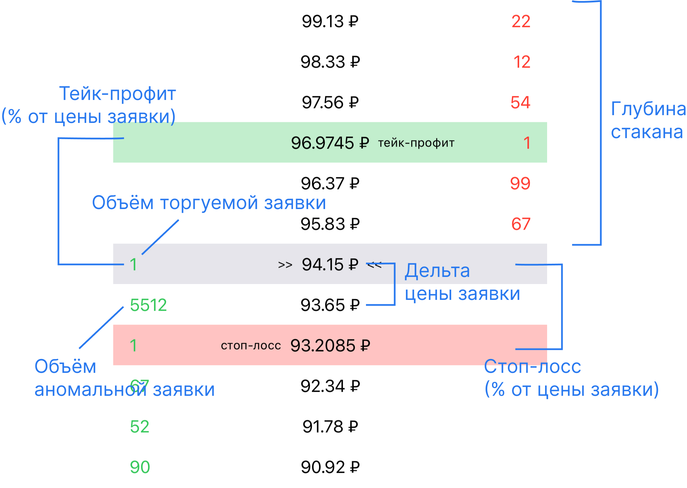

https://github.com/Tinkoff/invest-robot-contest/blob/main/examples.md

### Роботы на "стакане"
Робот отслеживает "стакан". Если лотов в заявках на покупку больше, чем в лотах на продажу в определенное количество раз, то робот покупает инструмент по рыночной цене, в противном случае – продает,
сразу выставляя поручение в обратную сторону, но с определенным процентом прибыли.


### Flat
Алгоритм основан на гипотезе: когда в стакане появляется заявка с аномально большим объёмом, есть вероятность, что произойдет отскок цены от данной заявки. Задача робота заключается в поиске таких заявок и заработке на таком отскоке
https://github.com/AndreVasilev/Kwatoko/blob/main/Readme%20resources/ContestStrategyTutorialReadme.md



### Робот на спреде
Робот при запуске формирует список инструментов, в которых спред (разница в "стакане" между лучшей ценой и лучшей ценой продажи) превышает определнное значение и выставляет две встречные заявки на покупку по нижней границе и на продажу по верхней, но всего на один шаг цены выгоднее существующих заявок. В дальнейшем периодически проводит коррекцию цен в случае, если в стакане появляются заявки выгоднее.

### https://github.com/AndreVasilev/Kwatoko

```json
{
    "interval": 1.0,
    "data": [
        {
            "asks": [
                { "quantity": 44, "price": 100.31 },
                { "quantity": 40, "price": 101.24 }
            ],
            "bids": [
                { "quantity": 22, "price": 99.13 },
                { "quantity": 12, "price": 98.33 }
            ]
        }
    ]
}
```

### links
https://github.com/kernc/backtesting.py
https://github.com/Elenchev/order-book-heatmap
https://www.investopedia.com/articles/active-trading/012815/top-technical-indicators-scalping-trading-strategy.asp
https://www.quantifiedstrategies.com/limit-order-book-trading-strategy/
https://github.com/topics/limit-order-book
https://github.com/topics/hft-trading?l=c%2B%2B
