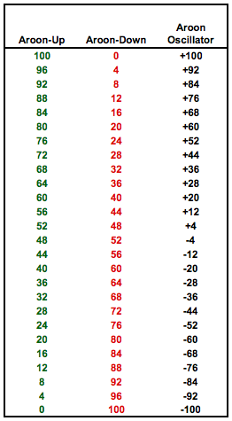
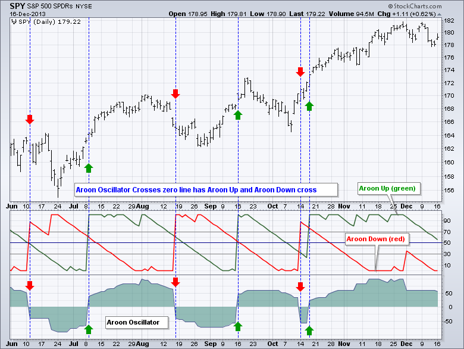

https://github.com/debut-js/Indicators/blob/master/src/supertrend.ts
https://dotnet.stockindicators.dev/indicators/AtrStop/#content
https://github.com/debut-js/Indicators/blob/master/src/chaikin.ts
https://currency.com/ru/chto-takoe-indikator-vortex
https://github.com/topics/technical-analysis?l=c%23
https://github.com/topics/stock-indicators?l=c%23
https://github.com/DaveSkender/Stock.Indicators
https://dotnet.stockindicators.dev/indicators/Stc/#content
https://dotnet.stockindicators.dev/
https://dotnet.stockindicators.dev/indicators/
https://dotnet.stockindicators.dev/indicators/Aroon/#content

https://github.com/DaveSkender/Stock.Indicators/tree/main/src/s-z

https://school.stockcharts.com/doku.php?id=technical_indicators:aroon_oscillator

Lbdthu + Rjydthu
https://bcs-express.ru/novosti-i-analitika/chto-takoe-divergentsiia-i-konvergentsiia-v-treidinge-uchimsia-iskat-signaly
https://smart-lab.ru/blog/533534.php
https://trader-blogger.com/divergenciya-i-konvergenciya.html
https://berg.com.ua/indicators-overlays/accumulation-distribution/

https://www.npmjs.com/package/technicalindicators
https://www.npmjs.com/search?q=technical%20indicators
https://www.scichart.com/blog/scichart-is-the-fastest-js-chart-library-available-and-why-that-matters-in-todays-world/
https://github.com/cinar/indicatorts/blob/main/src/indicator/volume/moneyFlowIndex.ts
https://github.com/debut-js/Indicators/blob/master/src/roc.ts

https://www.tradingview.com/script/4EMVvBkC-Open-Interest-Delta-By-Leviathan/\
