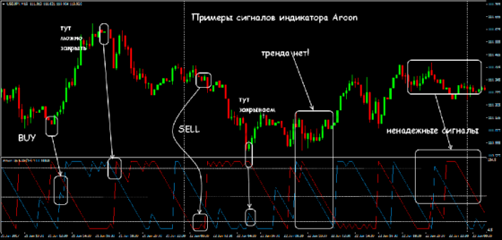
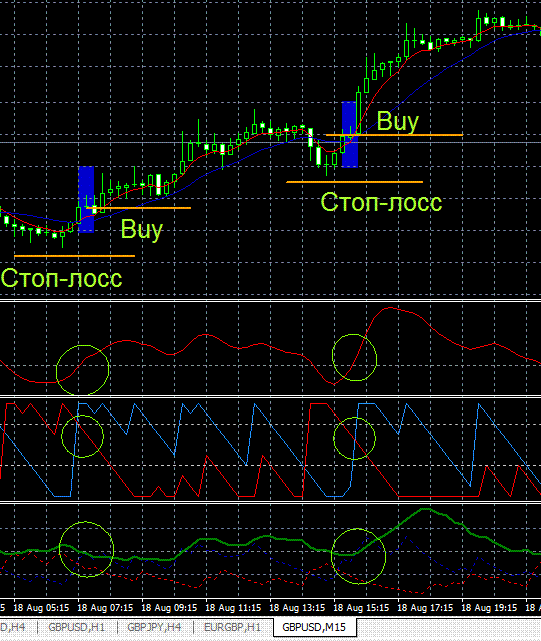
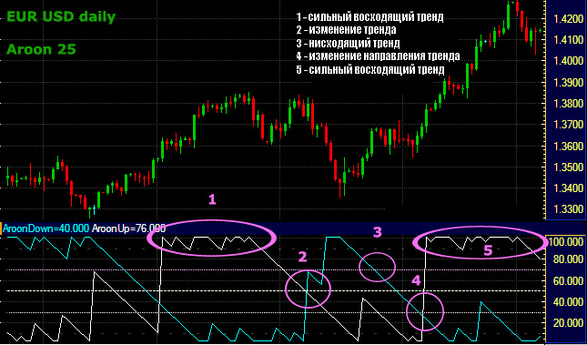

https://strategy4you.ru/forex-indicators/indikator-aroon.html

Aroon Oscillator является производным показателем от Aroon Indicator

diff: первый создает меньше сигналов, чем второй индикатор

Такой подход поможет не только найти оптимальные точки для открытия ордеров,
но и сможет отфильтровать неликвидные предложения.

Aroon Up отображается в синем цвете (или зеленом);
Aroon Down окрашена в красный.

ex:

ex:

